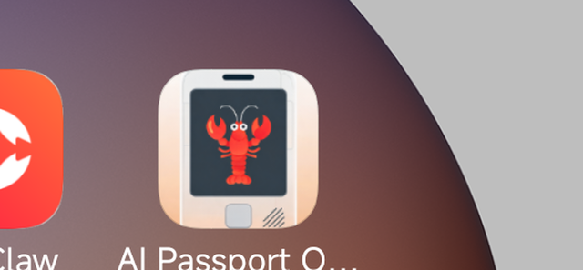
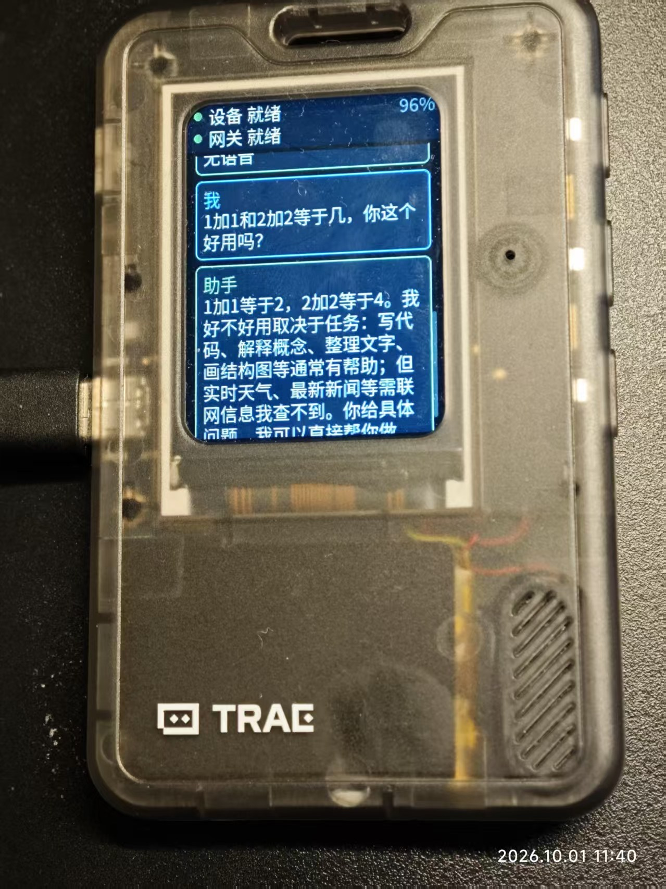
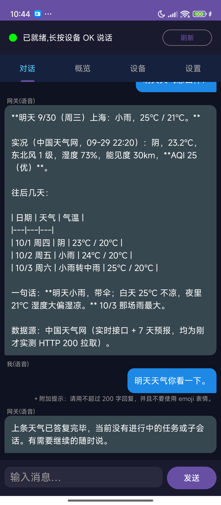
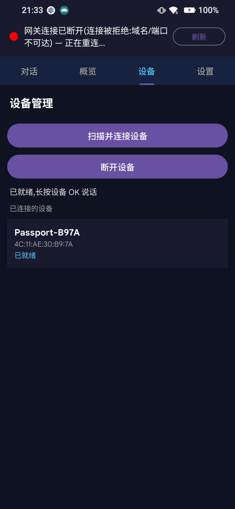
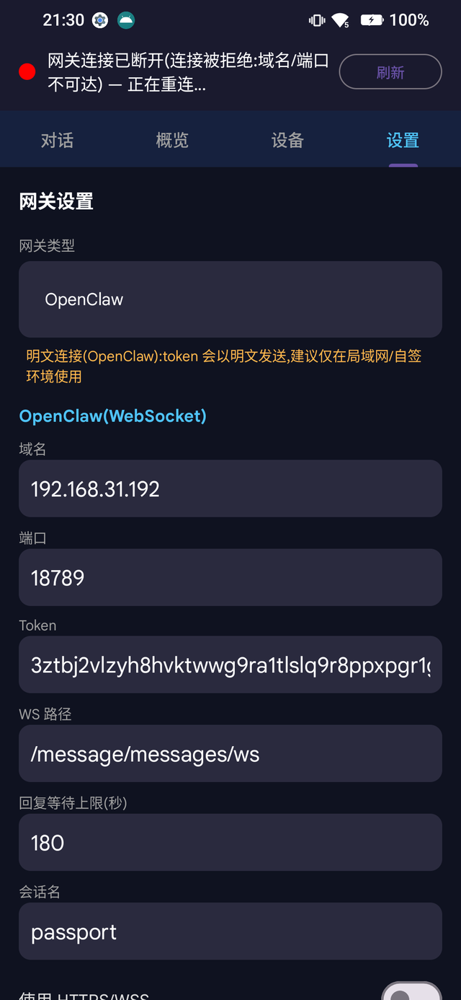
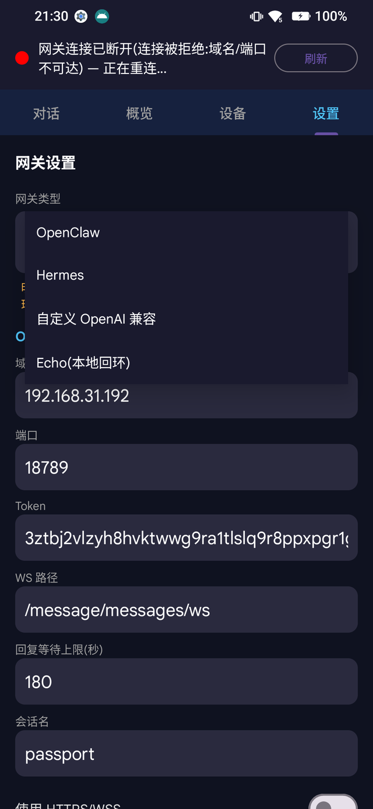
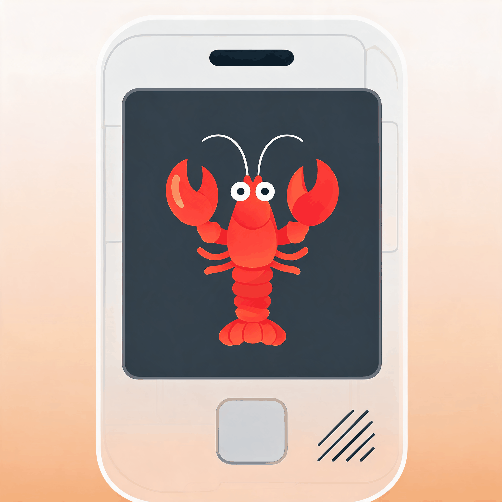

# AI Passport 随身AI对讲机 · Pocket Intercom

🎉 本项目已在 **AI Passport 社区**上架：[**随身 AI 对讲机 · Pocket Intercom**](https://ai-passport.folotoy.cn/plays/799/) · <https://ai-passport.folotoy.cn/plays/799/>

把 [AI Passport](https://github.com/Shinku-Chen/ai-passport) 变成一台随身 AI 对讲机：**按住 OK 说话 → 手机端 App 作为中介，把你的话交给后端 AI → 回答同时回到设备小屏和手机里**。

手机端作为中介，连接你的对讲机和后端 AI：后端**可以是 OpenClaw**，**也可以是兼容 OpenAI 的 Hermes 等接口**（同一套 App 里切换 ✓）。设备本身不用联网，语音只在「设备 ↔ 手机」之间走蓝牙。

> 本仓库是**项目入口**：包含手机端 App（本仓）与设备端固件的引用、下载入口、功能说明与使用方法。

| 我要 | 去哪里 |
| --- | --- |
| **下载手机 App** | [Releases](https://github.com/Shinku-Chen/ai-passport-openclaw-android/releases/latest) → `app-release.apk`（已签名） |
| **给设备刷固件** | [**Shinku-Chen/ai-passport（分支 feature/openclaw-intercom）**](https://github.com/Shinku-Chen/ai-passport/tree/feature/openclaw-intercom) → [Releases 列表](https://github.com/Shinku-Chen/ai-passport/releases) → 找**名字里带 `intercom` 的最新一版**（发布命名形如 `v1.8.0-intercom`）→ 下载 `FoloToy-AI-Passport-full.bin`（可直接烧录的合并镜像） |
| **在线刷机**（不用装工具） | <https://ai-passport.folotoy.cn/tools/web-flasher/> |
| **看别人做了什么** | [AI Passport 社区](https://ai-passport.folotoy.cn/plays/) —— 本项目已在社区上架：[**随身 AI 对讲机 · Pocket Intercom**](https://ai-passport.folotoy.cn/plays/799/) |

<p align="center">
  
</p>

---

## 这是什么

一台**不掏手机也能问 AI** 的小设备：

- 设备只有三个键，按住 **OK** 就是一次完整的「说—问—答」；
- 说话时设备屏立刻变红（正在准备），变绿就是**可以说了**，松手即发送；
- 手机 App 负责识别语音、把文本交给你的 AI 助理、再把回答回传设备；
- 设备端不联网、不需要 Wi-Fi 配网，也不需要把文件拷进设备。

适合的场景：做饭时问一句火候、出门前问一句要不要带伞、陪孩子随口问个为什么，或者把它放在桌上当"一句话就能用"的 AI 入口。

<p align="center">
  
  <br>
  <em>真机实拍：设备屏顶部「设备 就绪 / 网关 就绪」，下面是这一轮问答</em>
</p>

> ⚠️ **当前版本没有接入语音生成（TTS），所以网关返回的文字不会转成语音**：回复只以**文字**显示在设备小屏和手机 App 上，设备**不会把回答念出来** ✗。语音合成属于可能后续加入的能力，但**现在没有**这个功能 ✗，请不要按"能出声"预期它。

## 功能

**设备端（固件）**
- 按住 OK 说话：**按下即红 → 就绪变绿**，松开立即发送；说话不用等，开头不会丢
- 回复直接上屏，长回复自动滚到底；**UP / DOWN 翻看历史对话**，最多保留最近 6 条
- 背光 1 分钟自动熄灭，短按 OK 只点亮屏幕（不打扰）
- 顶栏常驻两行状态：`设备` 与 `网关`（就绪为纯白，异常时用气泡给出中文原因）
- 音量 / 麦克风增益由手机端统一下发；电量、时钟常显

**手机端（本 App）**
- 四个页签：**对话 / 概览 / 设备 / 设置**
- ⚠️ **不含语音合成（TTS）**：App 也**不朗读**回复 ✗ —— 只有文字上屏；设置页也没有相关开关（相关代码作为休眠能力保留，默认关闭 ✓，以后若要加会以新版本形式提供 ✓）
- **设备页**显示真实已连接设备（名称 + MAC + 链路状态），可扫描 / 连接 / 断开
- **网关类型下拉**：OpenClaw · Hermes · 自定义 OpenAI 兼容 · Echo（本地回环自测）
- **保存前先校验**：真的连一次，通过才落盘；失败弹出可读原因（token 不匹配 / 路径不对 / 需批准…）
- **会话独立**：默认使用 `agent:main:passport`，不与你 PC / 微信 / 飞书上的会话混在一起
- 保存成功后**自动让服务重载配置**，不需要重启 App
- 语音输入可在末尾自动附加一段**回复约束提示词**（默认"不超过 200 字、不要 emoji、不要 Markdown 表格"，可在设置页改；**文字输入不追加**）
- 聊天记录里可看到**完整的网关回传流**（状态 / 步骤 / 工具 / 正文），正文气泡还标注来源（`[流式]` / `[来自历史]`），便于排查
- 支持"一路多回复"：一轮里网关说了几句，设备上和 App 里都能看到

## 使用方法

### 1. 给设备刷固件

到固件仓的 [**Releases 列表**](https://github.com/Shinku-Chen/ai-passport/releases) 里找**名字里带 `intercom` 的最新一版**（发布命名形如 `v1.8.0-intercom`；这个仓库同时放了其他应用，认准 `intercom` 关键字即可），下载其中的 `FoloToy-AI-Passport-full.bin`，用[在线刷机工具](https://ai-passport.folotoy.cn/tools/web-flasher/)或 `esptool` 烧录（从 `0x0` 起烧合并镜像）。刷完设备会广播名形如 `Passport-XXXX`。

> 固件会持续更新，所以这里**不写死版本号** ：直接看 Releases 列表里带 `intercom` 的那一版就行。

**固件源码位置**（想自己编译或改）：

| 项 | 值 |
| --- | --- |
| 仓库（已含分支） | <https://github.com/Shinku-Chen/ai-passport/tree/feature/openclaw-intercom> |
| 对应的发布 | 在 [Releases](https://github.com/Shinku-Chen/ai-passport/releases) 里找名字带 `intercom` 的最新一版（形如 `v1.8.0-intercom`） |
| 构建 | ESP-IDF **5.5.3**，`idf.py -B build build`（构建与烧录细节见仓库内 `docs/development/engineering/build-and-test.md`） |
| 协议文档 | 仓库内 `docs/development/engineering/intercom-wire-protocol.md`（中英各一份） |

```bash
# 取固件源码(本应用对应的分支)
git clone --branch feature/openclaw-intercom https://github.com/Shinku-Chen/ai-passport.git
cd ai-passport
idf.py -B build build      # 需要已激活 ESP-IDF 5.5.3
```

### 2. 安装手机 App

到 [Releases](https://github.com/Shinku-Chen/ai-passport-openclaw-android/releases/latest) 下载 `app-release.apk` 安装（首次需允许"来自此来源"）。要求 **Android 8 以上**。

### 3. 与设备配对

1. 打开 App → **设备** 页 → 点「扫描并连接设备」；
2. App 找到 `Passport-XXXX` 后开始配对，**设备屏会显示 6 位配对码**，把它输入 App 弹出的输入框；
3. 配对成功后设备卡片显示名称与状态，设备屏顶栏 `设备` 一行显示「就绪」。

### 4. 配置网关（你的 AI 助理）

进 **设置** 页，在「网关类型」里选一种并填写，然后点 **「保存网关设置」**（App 会先真连一次，成功才保存）：

| 类型 | 需要填 |
| --- | --- |
| **OpenClaw** | 域名 / 端口 / token；会话名默认 `passport`。**首次连接时可能需要在管理端「批准本设备」**（见下） |
| **Hermes** | 域名 / 端口 / 密钥 / 模型名 |
| **自定义 OpenAI 兼容** | 域名 / 端口 / 请求路径（默认 `/v1/chat/completions`，只填 `/v1` 会自动补全）/ 密钥 / 模型名 |
| **Echo** | 什么都不用填，用于本地自测链路 |

#### 用 OpenClaw 时：首次连接需要在管理端授权同意

OpenClaw 网关要求**每台设备**先被批准一次（它用设备身份 + 签名鉴权）；未获批时 App 会直接告诉你，而不是抱成"连接失败"：

1. 点保存后，App / 设备屏会显示：**「等待网关授权：请在 OpenClaw 控制台批准本设备 (deviceId 8b87594d…)」**（设备屏上以状态气泡形式出现，App 顶部横幅同时显示）；
2. 到管理端批准这台设备，二选一：
   - **OpenClaw 控制台**：在电脑浏览器打开 `http://<网关地址>:<端口>/`（例如 `http://192.168.31.5:18789/`）→ 登录 → 进 **Devices / 设备** → 找到前面那串 `deviceId` 开头对应的设备（client 为 `openclaw-android`）→ **批准**；
   - **在网关主机跑 CLI**：`openclaw devices list` 找到待批设备，再 `openclaw devices approve <deviceId>`；
3. 批准后回到 App（等待期间它会**每 5 秒自动重试、最多等 180 秒**）——通常在等待界面里就自动完成并发提示「授权完成,网关设置已保存」；若已超时，再点一次「保存网关设置」即可；
4. 之后同一台手机不用再批 ✓（设备身份存在本机，除非重置 App 数据或网关侧清除了设备列表）。

> 没批准之前：语音识别、配对都是正常的 ✓，但**网关一直是"未授权"状态**✗，回复不会回来 ✗。

保存成功后：设备屏 `网关` 一行变「就绪」，App 顶部显示「已就绪,长按设备 OK 说话」。

### 5. 开始对话

1. **按住设备 OK**：屏幕立刻变红 → 稍后变绿（绿 = 可以说话了，通常 0.3 秒内）；
2. 变绿后对着设备说话，说完**松开 OK**；
3. 你的话会出现在设备屏（并同步到 App），随后 AI 的回答回到设备屏与 App；
4. 想追问就再按住 OK。**短按 OK 只点亮屏幕；长按 UP 进入设置页**（亮度 / 设备信息）。

## 界面

**真机实拍**（设备屏，实际一轮对话）：

<p align="center">
  
</p>

**手机 App**（下面的图都是实际截图）：

| 对话 | 设备 | 设置 |
| --- | --- | --- |
|  |  |  |

<p align="center">
  
</p>

### 图标（含原图与生成脚本）

桌面图标画的是**设备本身**，屏幕里是 **OpenClaw 的龙虾**：

<p align="center">
  
  <br>
  <em>图标原图：[<code>docs/design/app-icon-source.png</code>](docs/design/app-icon-source.png)（2048×2048，256 色，AI 生成后定稿）</em>
</p>

- **原图**：[`docs/design/app-icon-source.png`](docs/design/app-icon-source.png) —— 仓库内保留的就是生成所有安卓图标资源的**母版**（完整无损版为 AI 生成稿，未入库）。
- **生成脚本**：[`tools/make_android_icons.py`](tools/make_android_icons.py) —— 一条命令重新生成 `app/src/main/res` 里的整套图标（自适应图标 XML + 前景/背景图层 + 五个密度的方图与圆图）：

  ```bash
  python tools/make_android_icons.py            # 用仓库内母版
  python tools/make_android_icons.py 别的母版.png  # 也可以换自己的 2048×2048 图
  ```

- **屏幕里的龙虾标记**：[`docs/design/openclaw-logo.png`](docs/design/openclaw-logo.png) —— 属于 OpenClaw，商标归属见文末说明。

## 常见问题

| 现象 | 原因与处理 |
| --- | --- |
| 按下后一直不变绿 | 手机 App 没连上设备：检查蓝牙、看「设备」页是否显示已连接；必要时点「扫描并连接设备」 |
| 设备屏「网关未配置」 | 到设置页填写并保存网关信息 |
| 「网关 token 不匹配」 | 网关侧换了令牌：在设置页更新 Token 后保存 |
| 「等待网关授权」 | OpenClaw 要求**每台设备先被批准**（未批时 App 会显示 `deviceId` 开头那串）：到 OpenClaw 控制台 → **Devices / 设备** → 批准该设备，或在网关主机执行 `openclaw devices approve <deviceId>`；批准后 App 会自动继续（或再点一次保存）✓，详见上一节 |
| 回复一直是"流程汇报" | 这是**网关侧助理**的行为（例如它把"没有待处理任务"当成回答），与 App 无关；可在网关侧调整提示词或记忆 |
| 设备没有声音 / 不朗读回复 | **当前版本本来就没有语音生成** ✓：回复只以文字显示（设备屏 + App）✗，设备不会念出来；这是已知限制，不是故障 ✓ |
| 长回复看不全 | 设备会自动滚到底；用 UP / DOWN 上下翻看 |

## 技术说明（简）

- **设备 ↔ 手机**：自定义帧协议（`A5 5A` 头 + 类型 + 长度 + 载荷），音频用 **Opus 60ms 帧**（16 kHz 采集、约 3 KB/s），另有文本 / 控制 / 事件三条通道；配对使用 BLE 的 LE Secure Connections（6 位码确认）。协议细节见固件仓文档 `docs/development/engineering/intercom-wire-protocol.md`。
- **手机侧**：语音识别走小智云端（WebSocket，常驻预热，按下即可说）；网关通道抽象成 `GatewayAdapter`，OpenClaw 使用 ed25519 设备身份 + WebSocket RPC，另外三种走 OpenAI 兼容 HTTP。
- **不采集额外数据**：App 不做分析上报；网关 token / 密钥只保存在本机 SharedPreferences。
- **版本号三处一致**：固件 release tag `v1.10-intercom` ↔ App `versionName 1.10` ↔ 社区作品标题/说明里的同一版本号（两段式）；发新版时三处一起升，保证固件/App/社区功能对得上。

## English

**AI Passport Pocket Intercom** — hold the OK button on the device, speak, and the phone app — acting as the middleman — carries the words to your backend AI, then brings the answer back to the device screen and the phone app. The backend can be **OpenClaw**, an **OpenAI-compatible Hermes** endpoint, or any other OpenAI-compatible API. The device itself needs no Wi-Fi: audio travels over Bluetooth only. A real device photo is in [`docs/images/device.jpg`](docs/images/device.jpg), and the app screenshots are in `docs/images/`. This project is published on the AI Passport community: <https://ai-passport.folotoy.cn/plays/799/>.

> ⚠️ **This version has no text-to-speech: replies are text only.** The device will **not speak the answer aloud** — the reply is shown as text on the device screen and in the phone app. Voice synthesis may be added later, but it is **not** part of the current release, so please do not expect audio output.

- **App icon** — the launcher icon is the device itself with the OpenClaw crayfish on its screen. The source artwork is [`docs/design/app-icon-source.png`](docs/design/app-icon-source.png) (2048×2048) and [`tools/make_android_icons.py`](tools/make_android_icons.py) regenerates every `res/mipmap*` asset (adaptive XML, foreground/background layers, five densities for the square and round icons).
- **Firmware**: flash `FoloToy-AI-Passport-full.bin` from the firmware repository's [Releases page](https://github.com/Shinku-Chen/ai-passport/releases) — pick the **latest release whose name contains `intercom`** (releases look like `v1.8.0-intercom`; the repository also hosts other apps) — or use the [web flasher](https://ai-passport.folotoy.cn/tools/web-flasher/). The source is at [Shinku-Chen/ai-passport @ feature/openclaw-intercom](https://github.com/Shinku-Chen/ai-passport/tree/feature/openclaw-intercom), built with ESP-IDF 5.5.3.
- **Version pinning** — the firmware release tag (`vX.Y-intercom`), the app's `versionName` (`X.Y`) and the community listing all carry the same version; bump all three together so firmware, app and listing always describe the same features.
- **App**: install `app-release.apk` from [Releases](https://github.com/Shinku-Chen/ai-passport-openclaw-android/releases/latest) (Android 8+).
- **Pair**: Device tab → Scan and connect → type the 6-digit code shown on the device.
- **Gateway**: Settings → pick OpenClaw / Hermes / custom OpenAI-compatible / Echo, fill the fields and save (the app validates before saving). With **OpenClaw**, the gateway usually asks you to **approve this device once** from the admin side — the app shows `Waiting for gateway approval … (deviceId …)`; approve it in the OpenClaw console (Devices) or run `openclaw devices approve <deviceId>` on the gateway host, then save again (the app also retries automatically for up to 180 s).
- **Talk**: press and hold OK (screen turns red, then green — you may speak), release to send.

Screenshots are under `docs/images/`. The wire protocol and firmware live in [Shinku-Chen/ai-passport @ feature/openclaw-intercom](https://github.com/Shinku-Chen/ai-passport/tree/feature/openclaw-intercom).

## 说明与许可

- 本项目是个人维护的**非官方**项目；「AI Passport」「FoloToy」及相关商标归其所有者，「OpenClaw」及其吉祥物归 OpenClaw 项目所有，本项目仅在图标中作示意引用，不代表授权或背书。
- App 本体仅用于个人自用与社区分享；使用前请确认你遵守所用 AI 服务与网关的条款。
